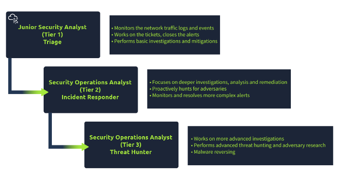

# Introdução ao analista de segurança junior

Um analista de Segurança Júnior, é um especialita em Triagem. Gastando muito tempo a fazer triagem ou a monitorar logs de eventos e alertas.

#### As responsabilidades de um analista de segurança júnior ou analista SOC Nível 1 incluem:

- Monitorar e invertiar os alertas(normalmente, é um ambiente de operações SOC 24 horas por dia, 7 dias por semana);

- Configurar e gerenciar as ferramentas de segurança;

- Desenvolver e implementar asinaturas básicas de IDS (Intrusion DEtection System)

- Participar de grupos de trabalho e reuniões do SOC;

- Crei tickets e escale os incidentes de segurança para nivel 2 e o líder da equipe, se necessário.

#### Qualificações Exigidas (mais comuns):

- 0-2 anos de experiência com operações de segurança

- Compreensão básica de redes(modelos OSI(modelo de interconexão de sitemas abertos)ou modelo tcp/IP (modelo de protocolo de controle de transmissão/modelo de protocolo de Internet)), sistemas operacionais (Windows, Linux), aplicativos da Web.

- Habilidades de script/programação são uma vantagem

#### Certificação desejada:

- CompTIA Segurança+

Uma visão geral do modelo de três camadas do Security Operations Center (SOC):

# Centro de Operações de segurança(SOC)
